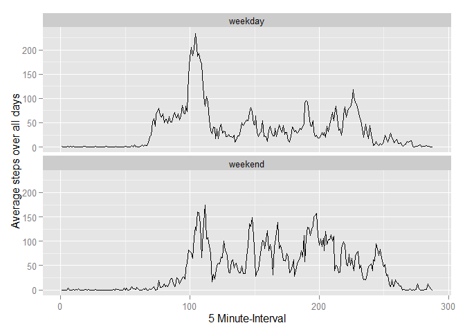

# Reproducible Research: Peer Assessment 1


## Loading and preprocessing the data
Load the data and print an initial summary.

```r
data <- read.table(unz("activity.zip", "activity.csv"), header=T, quote="\"", sep=",")
summary(data)
```

```
##      steps                date          interval     
##  Min.   :  0.00   2012-10-01:  288   Min.   :   0.0  
##  1st Qu.:  0.00   2012-10-02:  288   1st Qu.: 588.8  
##  Median :  0.00   2012-10-03:  288   Median :1177.5  
##  Mean   : 37.38   2012-10-04:  288   Mean   :1177.5  
##  3rd Qu.: 12.00   2012-10-05:  288   3rd Qu.:1766.2  
##  Max.   :806.00   2012-10-06:  288   Max.   :2355.0  
##  NA's   :2304     (Other)   :15840
```
Note, that there are multiple observations per day in the data set.

Check the data types of the imported data.

```r
str(data)
```

```
## 'data.frame':	17568 obs. of  3 variables:
##  $ steps   : int  NA NA NA NA NA NA NA NA NA NA ...
##  $ date    : Factor w/ 61 levels "2012-10-01","2012-10-02",..: 1 1 1 1 1 1 1 1 1 1 ...
##  $ interval: int  0 5 10 15 20 25 30 35 40 45 ...
```

Change the data type of the date column.

```r
data$date<-as.Date(data$date, format = "%Y-%m-%d")
str(data)
```

```
## 'data.frame':	17568 obs. of  3 variables:
##  $ steps   : int  NA NA NA NA NA NA NA NA NA NA ...
##  $ date    : Date, format: "2012-10-01" "2012-10-01" ...
##  $ interval: int  0 5 10 15 20 25 30 35 40 45 ...
```

## What is mean total number of steps taken per day?

Calculate the total number of steps taken per day. Note, the option na.rm=TRUE in the sum function, which ensures 
that missing values are removed.


```r
library(plyr)
```

```
## Warning: package 'plyr' was built under R version 3.1.3
```

```r
data_per_day<-ddply(data, .(date), summarize, totalSteps = sum(steps, na.rm=TRUE))
summary(data_per_day)
```

```
##       date              totalSteps   
##  Min.   :2012-10-01   Min.   :    0  
##  1st Qu.:2012-10-16   1st Qu.: 6778  
##  Median :2012-10-31   Median :10395  
##  Mean   :2012-10-31   Mean   : 9354  
##  3rd Qu.:2012-11-15   3rd Qu.:12811  
##  Max.   :2012-11-30   Max.   :21194
```

Histogram for the total number of steps per day.

```r
hist(data_per_day$totalSteps, main="Histogram of total steps per day", xlab="Total steps per day")
```

 

Calculate the mean and median total number of steps per day.

```r
paste("Mean total number of steps per day:",mean(data_per_day$totalSteps, na.rm=TRUE),sep=" ")
```

```
## [1] "Mean total number of steps per day: 9354.22950819672"
```

```r
paste("Median total number of steps per day:",median(data_per_day$totalSteps, na.rm=TRUE),sep=" ")
```

```
## [1] "Median total number of steps per day: 10395"
```

## What is the average daily activity pattern?

Calculate a time series plot of the 5-minute interval (x-axis) and the average number of steps taken, averafed accross all days.

```r
data_per_interval<-ddply(data, .(interval), summarize, averageSteps = mean(steps, na.rm=TRUE))
head(data_per_interval)
```

```
##   interval averageSteps
## 1        0    1.7169811
## 2        5    0.3396226
## 3       10    0.1320755
## 4       15    0.1509434
## 5       20    0.0754717
## 6       25    2.0943396
```

```r
tail(data_per_interval)
```

```
##     interval averageSteps
## 283     2330    2.6037736
## 284     2335    4.6981132
## 285     2340    3.3018868
## 286     2345    0.6415094
## 287     2350    0.2264151
## 288     2355    1.0754717
```
The are 288 rows which represents the total number of possible 5 minute intervals per day (12 per hour).
Note, the day start with the interval "0" that represents the first 5 minutes of the day. Therefore the interval 2355 represents the last 5 minutes of the day from 23:55 to 24:00.

However, it is not reasonable to take the interval data in this form as the x axis, because this would lead to a false interpretation of the steps between hours (e.g. 0355 to 0400).

A wrong plot would be.

```r
library(ggplot2)
```

```
## Warning: package 'ggplot2' was built under R version 3.1.3
```

```r
ggplot(data_per_interval,aes(x=interval,y=averageSteps))+geom_line()+xlab("Interval")+ylab("Average steps over all days")
```

 

Calculate a sequence of 5 minute intervals, to get a correct x-Axis.


```r
data_per_interval$interval_seq<-seq(data_per_interval$interval)
summary(data_per_interval)
```

```
##     interval       averageSteps      interval_seq   
##  Min.   :   0.0   Min.   :  0.000   Min.   :  1.00  
##  1st Qu.: 588.8   1st Qu.:  2.486   1st Qu.: 72.75  
##  Median :1177.5   Median : 34.113   Median :144.50  
##  Mean   :1177.5   Mean   : 37.383   Mean   :144.50  
##  3rd Qu.:1766.2   3rd Qu.: 52.835   3rd Qu.:216.25  
##  Max.   :2355.0   Max.   :206.170   Max.   :288.00
```
Plot the data.

```r
ggplot(data_per_interval,aes(x=interval_seq,y=averageSteps))+geom_line()+xlab("5 Minute-Interval")+ylab("Average steps over all days")
```

 

Which interval contains the maximum number of steps?


```r
paste("Interval with maximum values:",data_per_interval[which.max(data_per_interval$averageSteps),]$interval,sep=" ")
```

```
## [1] "Interval with maximum values: 835"
```

```r
paste("Interval sequence number with maximum value:",data_per_interval[which.max(data_per_interval$averageSteps),]$interval_seq,sep=" ")
```

```
## [1] "Interval sequence number with maximum value: 104"
```


## Imputing missing values

Calculate and report the number of missing values in the dataset.

```r
sum(is.na(data$steps))
```

```
## [1] 2304
```

A better way that adheres all columns is based on the number of complete cases. Since we already know from the initial summary that there are only NA's in the steps column, this is not necessary.

```r
nrow(data)-sum(complete.cases(data))
```

```
## [1] 2304
```

Strategy for imputing the missing values. It seems to be more appropriate to fill in by the average value of the interval than on the average value of the day, because the activity patterns within a day is very different. The 
following code first calculates the average steps per interval and then calculates the imputed steps.

```r
data2<-ddply(data, .(interval), mutate, averageSteps = mean(steps, na.rm=TRUE),
                                           imputedSteps = ifelse(is.na(steps),averageSteps,steps))
```

Calculate the data per day for the imputed data set.


```r
data2_per_day<-ddply(data2, .(date), summarize, totalSteps = sum(imputedSteps, na.rm=TRUE))
summary(data2_per_day)
```

```
##       date              totalSteps   
##  Min.   :2012-10-01   Min.   :   41  
##  1st Qu.:2012-10-16   1st Qu.: 9819  
##  Median :2012-10-31   Median :10766  
##  Mean   :2012-10-31   Mean   :10766  
##  3rd Qu.:2012-11-15   3rd Qu.:12811  
##  Max.   :2012-11-30   Max.   :21194
```

Histogram for the total number of steps per day for the imputed data.

```r
hist(data2_per_day$totalSteps, main="Histogram of total steps per day for the imputed data", xlab="Total steps per day")
```

 

The distribution looks like a normal distribution. The key difference is that the distribution especially with respect 
to the zero values is corrected.

Calculate the mean and median total number of steps per day for the imputed data.

```r
paste("Mean total number of steps per day for the imputed data:",mean(data2_per_day$totalSteps, na.rm=TRUE),sep=" ")
```

```
## [1] "Mean total number of steps per day for the imputed data: 10766.1886792453"
```

```r
paste("Median total number of steps per day for the imputed data:",median(data2_per_day$totalSteps, na.rm=TRUE),sep=" ")
```

```
## [1] "Median total number of steps per day for the imputed data: 10766.1886792453"
```

## Are there differences in activity patterns between weekdays and weekends?

Calculate the weekday.

```r
Sys.setlocale("LC_TIME", "English")
```

```
## [1] "English_United States.1252"
```

```r
data3<-mutate(data2,weekdays=weekdays(data2$date), weekday=ifelse(weekdays %in% c("Saturday","Sunday"),"weekend","weekday"))
```

Calculate the sequence numbers by day.

```r
data3<-ddply(data3, .(date), mutate, intervalSeq = seq(interval))
```

Calculate the acitivty pattern per weekdays and weekends

```r
data4<-ddply(data3, .(weekday,intervalSeq), summarize, averageSteps = mean(steps, na.rm=TRUE))
```

Now plot the time series with respect to weekdays and weekends.

```r
ggplot(data4,aes(x=intervalSeq,y=averageSteps))+geom_line()+facet_wrap(~weekday,ncol=1)+xlab("5 Minute-Interval")+ylab("Average steps over all days")
```

 

Calculate the hour and minutes instead of the sequence number.

```r
data4<-mutate(data4,time=strftime(strptime(paste(intervalSeq %/% 12,(seq(1:288)*5) %% 60,sep=":"),"%H:%M"),"%H:%M"))
```
Now plot the time series with respect to weekdays and weekends ans the new time axis.

```r
library(scales)
```

```
## Warning: package 'scales' was built under R version 3.1.3
```

```r
ggplot(data4,aes(x=strptime(time, "%R"),y=averageSteps))+geom_line()+facet_wrap(~weekday,ncol=1)+xlab("Time")+ylab("Average steps over all days")+scale_x_datetime(labels = date_format("%H:%M"))
```

 

It is clearly visible that on weekdays there is more activity in the early morning. However, on weekends there is more activity between 12:00 and 18:00.

